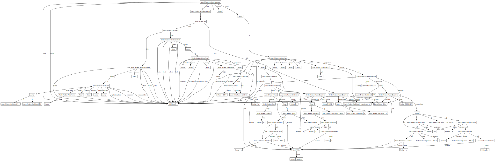

## Running
```bash
./run.sh
```


In order to generate so many pixel values, we're going to use a quite uncommon SQL construct called a recursive common table expression.
A common table expression (CTE) is created with the `WITH` keyword, and is used for creating temporary named result sets. This lets you break down big queries into smaller chunks, giving you intermediary tables in a virtual table, so you don't have to `CREATE TABLE`, calculate stuff, then `DROP TABLE`. `WITH RECURSIVE` does this too, but uses its own table data again and again until there are no more rows (ie some condition is met).

Say we want to construct an SQL query that simply counts up to 10.

First, let's define a recursive CTE with `WITH RECURSIVE`. Then, name it (just "foo" in this example). I'm also going to explicitly define a column named `n`, which will be the only one in the CTE and will contain our number.
```sql
WITH RECURSIVE foo(n)
```
then, we need to create the create the actual recursive query.
```sql
SELECT 1     -- this will be the inital value of n.
UNION ALL    -- combining the result of SELECT 1 with the following SELECT resultset
SELECT n + 1 -- the recursive bit - takes the value of n from the previous step and increments it
FROM foo     -- referring to our CTE
WHERE n < 10 -- we don't want to go on forever! This is our end condition
```
put it together and we get
```sql
WITH RECURSIVE foo(n) AS (SELECT 1 UNION ALL SELECT n + 1 FROM foo LIMIT 10) SELECT n FROM foo;
```

```sql
sqlite> WITH RECURSIVE foo(n) AS (SELECT 1 UNION ALL SELECT n + 1 FROM foo LIMIT 10) SELECT n FROM foo;
1
2
3
4
5
6
7
8
9
10
```
This looks like what we want, but there's a problem; each number is its own row. If we were querying real data, this would be exactly what we want, but we're trying to construct a string here.
When we run
```ruby
ActiveRecord::Base.connection.execute("WITH RECURSIVE foo(n) AS (SELECT 1 UNION ALL SELECT n + 1 FROM foo WHERE n < 10) SELECT n FROM foo")
```
we get the following back:
```ruby
{"n"=>1}
{"n"=>2}
{"n"=>3}
{"n"=>4}
{"n"=>5}
{"n"=>6}
{"n"=>7}
{"n"=>8}
{"n"=>9}
{"n"=>10}
```
Now, we *could* just concat them in Ruby, like so
```ruby
res = ActiveRecord::Base.connection.execute("WITH RECURSIVE foo(n) AS (SELECT 1 UNION ALL SELECT n + 1 FROM foo WHERE n < 10) SELECT n FROM foo")
puts res.map { |curr| curr["n"] }.join(", ") # 1, 2, 3, 4, 5, 6, 7, 8, 9, 10
```
But the goal here is to do as much computation in SQL as possible. Luckily, `SQLite` has both a print function (a pseudo-reimplementation of C's `stdio.h` `printf`) and a row concatenation function - [`PRINTF`](https://sqlite.org/printf.html) and [`GROUP_CONCAT`](https://www.sqlite.org/lang_aggfunc.html#group_concat) respectively.
We can use them to format our rows however we like.
```sql
sqlite> WITH RECURSIVE foo(n) AS (SELECT 1 UNION ALL SELECT n + 1 FROM foo LIMIT 10) SELECT GROUP_CONCAT(PRINTF("number: %i", n), ', ') FROM foo;
number: 1, number: 2, number: 3, number: 4, number: 5, number: 6, number: 7, number: 8, number: 9, number: 10
```
Here, `PRINTF("number: %i", n)` is formatting each row (we would write `"number #{n}"` in Ruby) and `GROUP_CONCAT` is essentially acting as Ruby's `Array#join`.

### Where `Arel::Nodes::NamedFunction` breaks down
AFAIK, Arel does not support defining common table expressions with explicit columns.
I thought I could define it as a `NamedFunction` node, like so;

```ruby
Arel::Nodes::NamedFunction.new("numbers", [Arel.sql("n")])
```
but as I understand this is for *calling* named functions, not defining them, because while the direct `.to_sql` output *is* what's needed for defining a CTE, when used in more complex queries it breaks down, as demonsrated below.

The following works as expected;
```ruby
cte_def = Arel::Nodes::NamedFunction.new("numbers", [Arel.sql("n")])
as_stmt = Arel::Nodes::As.new cte_def, Arel.sql("foo")
puts as_stmt.to_sql
```
Outputs `numbers(n) AS foo`.

But when used within another method, not so much

```ruby
cte_def = Arel::Nodes::NamedFunction.new("numbers", [Arel.sql("n")])
as_stmt = Arel::Nodes::As.new cte_def, Arel.sql("foo")
select_manager = Arel::SelectManager.new
puts select_manager.with(as_stmt).to_sql
```
Outputs `WITH "numbers" AS foo SELECT`
It turns out that the `Node::NamedFunction`'s `name` method is being called, which we defined as `numbers`. Secondly, because the return type of `name` is a string, Arel is wrapping it in quotes in the sql output.

For now, I'm going to make a very hacky fix, but I hope it can be fixed in idiomatic Arel. If you know how, let me know.

```ruby
cte_def = Arel::Nodes::NamedFunction.new("numbers", [Arel.sql("n")])
cte_def.define_singleton_method(:name) do
    # Making this an SqlLiteral node ensures it's not wrapped in quotes, as a string would be.
    Arel.sql("numbers(n)")
end
```

<!-- dot recursion.dot -T svg -o recursion.svg -->


### Sources
* https://stackoverflow.com/q/57613637/10652680
* https://jpospisil.com/2014/06/16/the-definitive-guide-to-arel-the-sql-manager-for-ruby
* https://rubydoc.info/gems/arel/
* The ActiveRecord Github repo, especially the tests!

