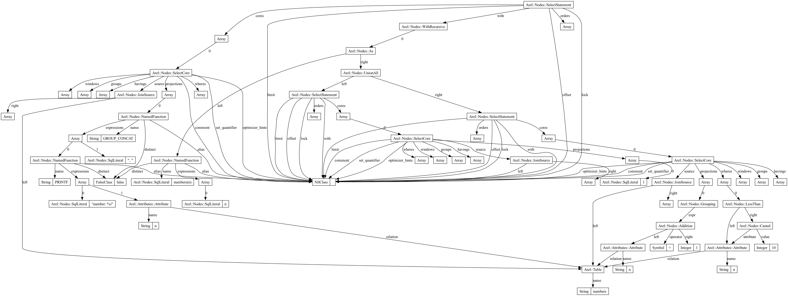

```sql
sqlite> WITH RECURSIVE foo(n) AS (SELECT 1 UNION ALL SELECT n + 1 FROM foo LIMIT 10) SELECT n FROM foo;
1
2
3
4
5
6
7
8
9
10
```
```sql
sqlite> WITH RECURSIVE foo(n) AS (SELECT 1 UNION ALL SELECT n + 1 FROM foo LIMIT 10) SELECT GROUP_CONCAT(PRINTF("number: %i", n), ', ') AS RES FROM foo;
number: 1, number: 2, number: 3, number: 4, number: 5, number: 6, number: 7, number: 8, number: 9, number: 10
```

### The breakdown of `Arel::Nodes::NamedFunction`s
As far as I know, Arel does not support defining common table expressions with explicit columns.
I thought I could define it as a `NamedFunction` node, like so;

```ruby
Arel::Nodes::NamedFunction.new("numbers", [Arel.sql("n")])
```
but as I understand this is for *calling* named functions, not defining them, because while the direct `.to_sql` output *is* what's needed for defining a CTE, when used in more complex queries it breaks down, as demonsrated below.

The following works as expected;
```ruby
cte_def = Arel::Nodes::NamedFunction.new("numbers", [Arel.sql("n")])
as_stmt = Arel::Nodes::As.new cte_def, Arel.sql("foo")
puts as_stmt.to_sql
```
Outputs `numbers(n) AS foo`.

But when used within another method, not so much

```ruby
cte_def = Arel::Nodes::NamedFunction.new("numbers", [Arel.sql("n")])
as_stmt = Arel::Nodes::As.new cte_def, Arel.sql("foo")
select_manager = Arel::SelectManager.new
puts select_manager.with(as_stmt).to_sql
```
Outputs `WITH "numbers" AS foo SELECT`
It turns out that the `Node::NamedFunction`'s `name` method is being called, which we defined as `numbers`. Secondly, because the return type of `name` is a string, Arel is wrapping it in quotes in the sql output.

I hope you can fix this in idiomatic Arel, and if you know a way, please let me know. But for now I'm going to make a very hacky fix;

```ruby
cte_def = Arel::Nodes::NamedFunction.new("numbers", [Arel.sql("n")])
cte_def.define_singleton_method(:name) do
    # Making this an SqlLiteral node ensures it's not wrapped in quotes, as a string would be.
    Arel.sql("numbers(n)")
end
```

<!-- dot recursion.dot -T png -o recursion.png -->


### Sources
https://stackoverflow.com/q/57613637/10652680
